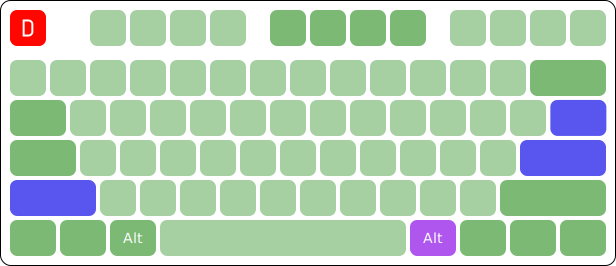
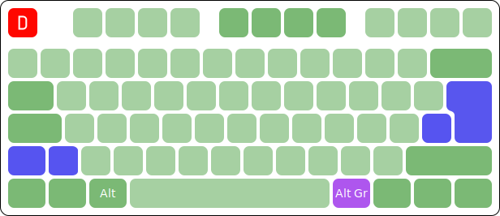

[&larr; Installation instructions and more scripts](../../README.md)

# [`wide_left_shift.ahk`](./wide_left_shift.ahk)

**Maps the extra key
between the <kbd>Left Shift</kbd> and <kbd>Z</kbd> keys
to <kbd>Left Shift</kbd>.**

What extra key?
My work laptop's keyboard has an ISO layout,
so the <kbd>Left Shift</kbd> key is narrower than in ANSI layouts,
and there's an extra key
between the <kbd>Left Shift</kbd> and <kbd>Z</kbd> keys.

I use US English as the input language in Windows,
so the extra key is unnecessary for me.
With this script
I can pretend that
the <kbd>Left Shift</kbd> key is as wide as it should be.

ANSI keyboard layout:

ISO keyboard layout:

Keyboard layout illustrations by Daniel Beardsmore,
from [_ANSI vs ISO_ page on Deskthority wiki](https://deskthority.net/wiki/ANSI_vs_ISO),
licensed under "Public domain or nearest equivalent."
Illustrations minified with
[SVGOMG](https://jakearchibald.github.io/svgomg/).
